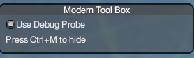
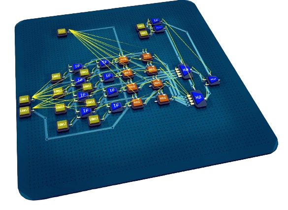
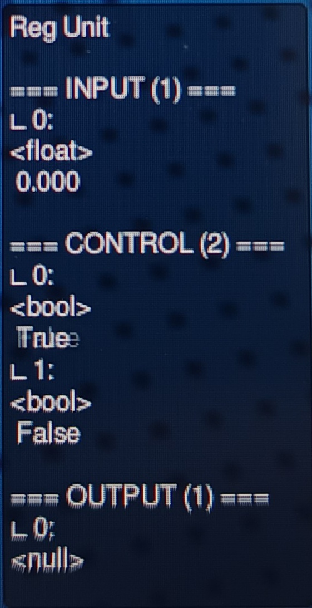

# Debug View

Debug view will visualize the connection between units and show the information of unit.

## Toggle Debug View

## Unit Connection

## Unit Informtion
After enable the debug view, if you point your cursor at a unit, you can see the information of a unit's ports, including
- Input signals
- Control signals
- Output signals

