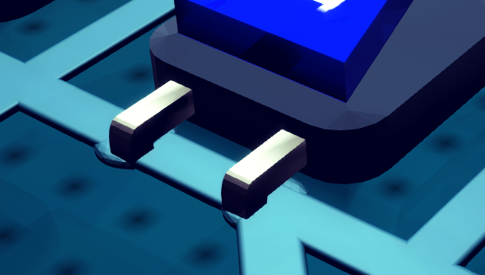

# Port

Port is a very important component for unit.

## What is port
1. Port is a container of signal.

2. The signal of a port can be set. Once set, the port will transmit the signal to other **destination**.

3. As depicted in the unit's structure, there are three groups of ports, they are `input ports`, `control ports` and `output ports`.

4. All ports have attached unit, and the unit need to be placed to `circuit board` so that ports can function.

### Input/Control ports
They receive signals from other output ports (those wired to them on ciruit board).

Once a signal is received and the received signal is different from the previous signal they held, they will told the attached unit that the signal has been updated, then the unit will regenerate the outputs based on the updated inputs/controls.

:::warning
**Only one output port** is allowed to be wired to a certain input ports. Or the behavior may be unpredictable.
:::

### Output ports
Their signals are set by their own attached units.

Once the signal is set and the new signal is different from the previous signal they held, they will send the new signal to all of the input/control ports that are wired with them.

:::note
One output port can be wired to multiple input/control ports.
:::

## Port Type
Similar with signal, port has types too. The type of port specifies the type of signal they held.

Types:
- bool
- float
- vector2
- vector3
- quaternion
- package
- image
- any

If the type of the signal received is different from the port's type, the signal held in port will be set to null (the signal with type `null`), except for ports with type `any`.

## Port Layout
The port layout follows the following pattern
- input ports on the left edge of unit
- control ports on the top edge of unit
- output ports on the right edge of unit

## Port Index
The port index follows the following pattern
- for input ports, increasing from top to bottom, start from 0.
- for control ports, **increasing from right to left**, start from 0.
- for output ports, increasing from top to bottom, start from 0.
