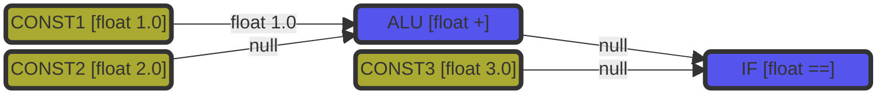
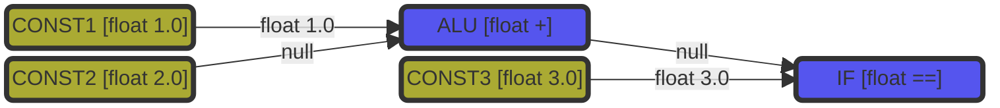
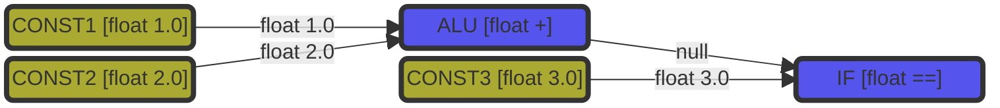
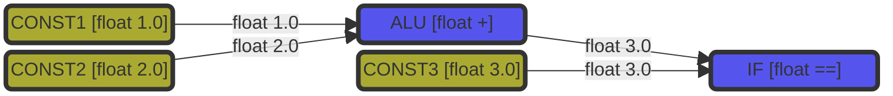

# Timing

Timing is a very critical part of this mod that nedds special attention.

There are generally two kinds of unit in this mod, `Immediate Unit` & `Trigger Unit`.
- Immediate Unit: the unit is updated (regenerate output) immediately when the input signals are updated. The speed of deduction of a series of immediate units is zero theoretically in game world.
- Trigger Unit: the unit is updated in each physical frame (100hz). Most of them are sensors, mainly responsible to trigger the update of other immediate unit.

Those two concepts maybe abstract. Let me explain it through some exapmles.

**Example 1:**
Let consider the following simple logic circuit, there are three trigger unit and two immediate unit.
At the beginning, no signal is passing among these units.

On the first frame, three trigger units (`CONST`) generate float signal at output ports one by one.
:::note
The order of generating outputs can be totally random. Here we use the order of CONST1->CONST3->CONST2
:::
Begin with CONST1:

Because of the update in the first input port, ALU's update function is called. However, the second input of ALU is `null`, so ALU generate `null` at output port. Nothing is changed and IF is not affected.

Then comes CONST3's turn:

Because the first input of IF is `null`, IF generate `null` at output port. Nothing is changed.

Finally comes CONST2's turn:

Because of the update in the second input port, ALU's update function is called. ALU generate `float 3.0` at output port.

Because of the update in the first input port, IF's update function is called. IF generate `true` at output port.

:::note
As soon as all the trigger units have updated the output, the circuit is bound to generate all the related outputs.
:::
