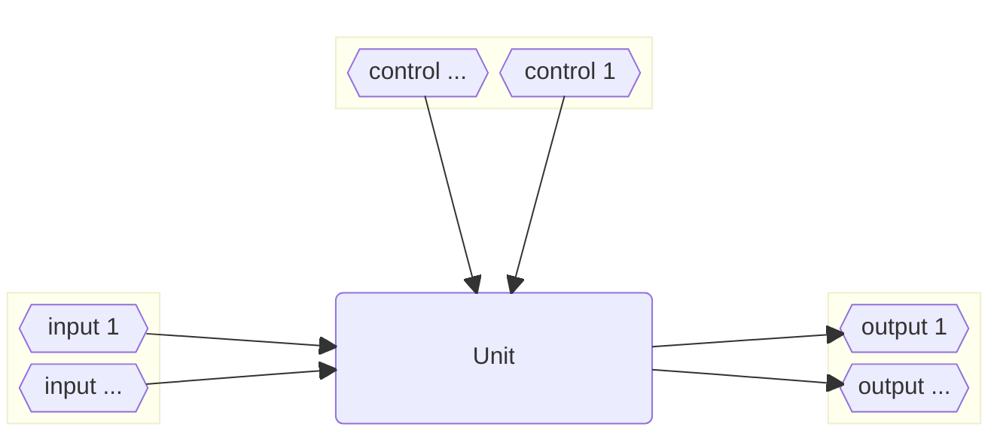
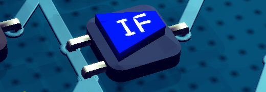
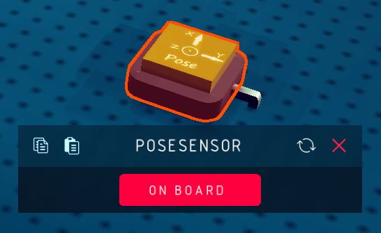
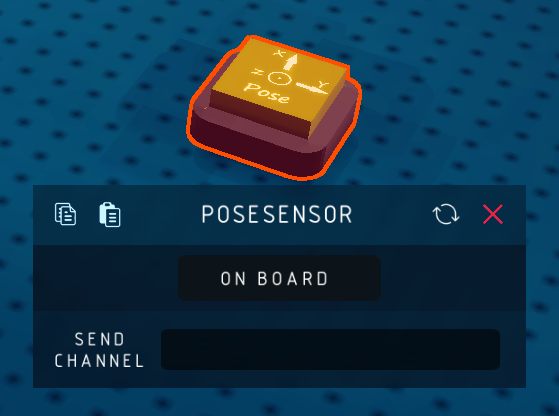

# Unit

Unit is the logic block that have ports, thus can be recoginzed by the circuit board.

The basic structure of a unit.

Usually, it has solid dark base.

## Off-board / On-board Mode

Some of the units have off-board mode, i.e. they can be placed anywhere to complete their task.

When configured as off-board, the unit will hide their physical ports and receive/send wireless signal.

Take off-board mode of `Pose Sensor` as example, when configured as off-board, there will be a mapper called `Send Channel`, specifying the channel through which the wireless signal is transmitted (will be discussed later in the `Wireless` chapter).

## Behaviour

### Logic units

When the signal from input/control ports changed, they will update the signals at output ports immediately (the update can happen multiple times per frame, **dangerous**, wasn't it)

### Sensors

For each physical frame (every 0.01s), read the sensor configuration signals from input ports and generate outputs.

:::note[Notation]
For many sensors, the ouput signal's type is `package`, containing multiple data. For example, IMU will ouput the package signal containing velocity (vector3), acceleration (vector3), angular velocity (vector3) and a place holder(null). You need to use `UNPACKER` to extract the information you want.
:::

### Executors

For each physical frame (every 0.01s), read the signals from input ports and perform the action, such as press a key, move to a certain angle, display something.

:::note[Notation]
Similar with sensors, some of the executors receive `package` type input signal.
:::
