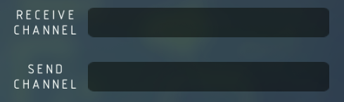

# Wireless

If you see `RECEIVE CHANNEL` or `SEND CHANNEL` in the mapper of a unit, it means that the unit support wireless feature.

:::note
Most blocks need to be set as `off-board` to enable the feature
:::

The `SEND CHANNEL` can be considered as a virtual output port.

The `RECEIVE CHANNEL` can be considered as a virtual input port.

If unit `A`'s `SEND CHANNEL` is same as unit `B`'s `RECEIVE CHANNEL`, you can imagine that `A`'s output port is connected to `B`'s input port.

:::warning
Similar with ordinary ports, it is not recommend to share the same `SEND CHANNEL` amoung different units (equivalent to connecting an input port with multiple output ports).
:::
