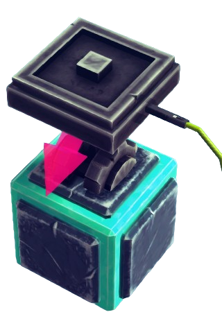
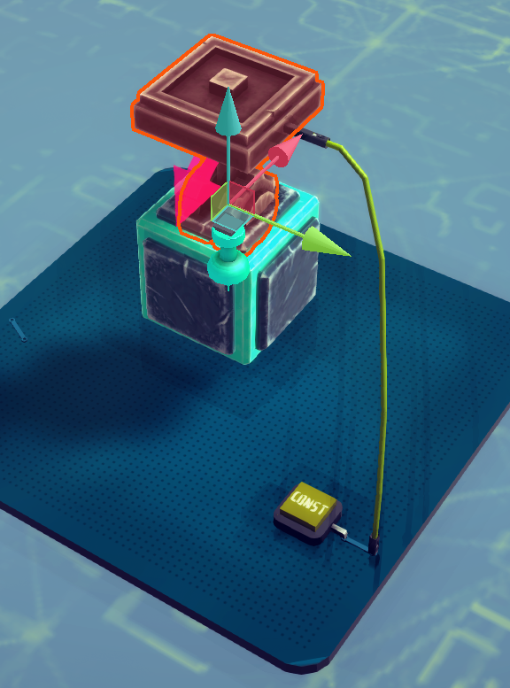
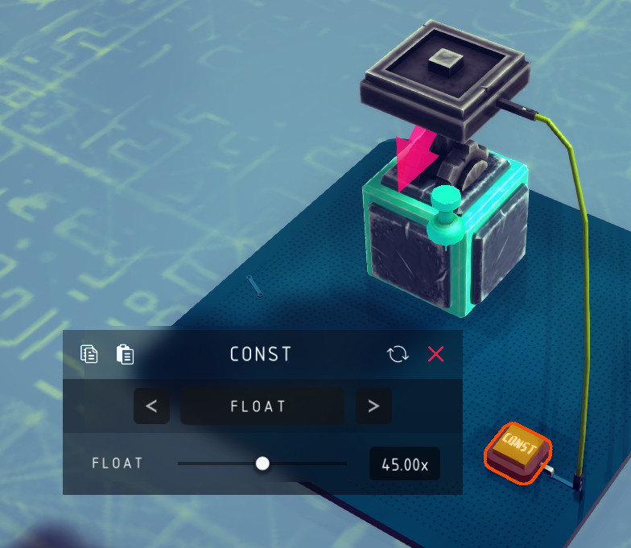
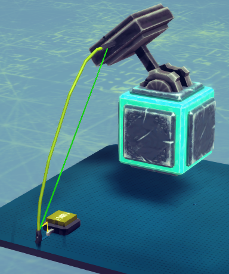

# STEERING HINGE

Precise angular motion output.

## INPUT

No wireless mode and no `on-board` port is avaliable. Need to use INPUTPIN to receive input signal.

Place a INPUTPIN on the hinge and use WIRE to connect it will a OUTPUTPIN, signal type must be `float`.

## Function

When receive the `float` signal, the hinge will rotate to the desired angle (along the y-axis (green arrow)).

