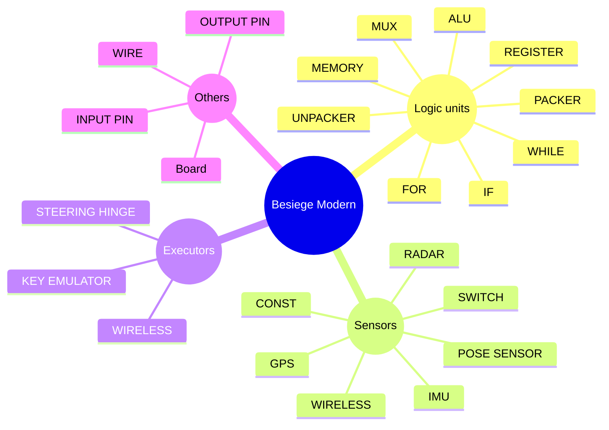

# Mod Intro

This is the documentation for **Besiege-Modern-Mod**.

:::tip[TIP]
**Besiege-Modern-Mod** can be subscribed in steam workshop.

link: https://steamcommunity.com/sharedfiles/filedetails/?id=3205528109
:::

## Objective
Today, some of the logic components that come with besiege have been able to achieve some basic automation. By combining sensors, timers, and logic gates, creative players have built whole bunch of incredible creations.
However, in the game itself, it is very difficult to perform numerical calculations, and it may take dozens or hundreds of logic parts to form a computing unit. This method is not efficient, not to mention that setting up virtual logic cases is also very painful.

Then I came up with this mod, where the logic units are succinctly wired on a ciruit board and can handle varies kind of signals, such as
- null
- bool
- float
- vector2 (2D coordinates)
- vector3 (3D coordinates, position/velocity/acceleration)
- Quaternion (rotation)
- package (collection of multiple signals, can be considered as parallel data, like \{bool, float, vector3, null\}).

I believe that as the basic units of the mod is complete, besiege players can build automated machinery with fancier fucntions. The only limit is imagination while **besiege players never lack that**.

***Let's make it happen!!!***

## Overview of the mod
Generally, there are four kinds of block in this mod, i.e. **sensors**, **logic units**, **executors** (corresponding to input→process→output) and **others**.

### Logic units
All of the logic units has input pins and output pins, some of them may have control pins as well.
They get the data from input pins, process it and generate outputs.
In this mod, we have:
- `IF`          if condition
- `ALU`         numerical calculation
- `WHILE`       conditional loop
- `FOR`         times loop
- `PACKER`      pack up input signal
- `UNPACKER`    unpack input signal
- `MUX`         select input signal
- `REGISTER`    store single signal
- `MEMORY`      store signals with address

### Sensors
All of the sensors has output pins, some of them may have input pins as well.
They are mainly responsible for generating signal for processing/execution.
Equipped with wireless mode.
- `CONST`           generate constant signal
- `SWITCH`          generate bool signal which can be toggled by key
- `POSE SENSOR`     generate pose information
- `GPS`             generate position information
- `IMU`             generate velocity, acceleration information
- `RADAR`           detect object and generate the information of the detected object
- `WIRELESS`        receive wireless signal and output it

### Executors
All of the executors has input pins.
Equipped with wireless mode(except for steering hinge).
- `KEY EMULATOR`    emulate holding key
- `STEERING HINGE`  steer to the given angle
- `WIRELESS`        send wireless signal

### Other
Connect logic units, sensors and executors all together and make magics happen.
- `Board`       put units on it and wire them up
- `INPUT PIN`   the input port for the board
- `OUTPUT PIN`  the output port for the board
- `WIRE`        connect the input port and output port
