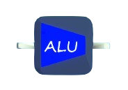

# ALU

## Input Ports
The number of inputs can be set by the first menu mapper.

There are two choices, `1 INPUT` or `2 INPUT`.

### 1 INPUT
The type of `i1` can be set by the second menu mapper.

Type can be:
- bool
- float
- vector2
- vector3
- quaternion

### 2 INPUTS
The type of `i1` and `i2` can be set by the second menu mapper.

Type can be:
- bool for both `i1` and `i2`
- float for both `i1` and `i2`
- vector2 for both `i1` and `i2`
- vector3 for both `i1` and `i2`
- quaternion for both `i1` and `i2`
- vector2 for `i1` and float for `i2`
- vector3 for `i1` and float for `i2`

## Output Ports
One output port (`o1`), with the type of `any`.

## Function
- `1 INPUT`: Calculate the result of \<`operator`(`i1`)\> and export result to `o1`.
- `2 INPUT`: Calculate the result of \<`i1` `operator` `i2`\> and export result to `o1`.
