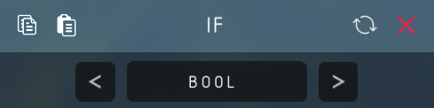

# IF

## Input Ports
There are two input ports (`i1`,`i2`).
Their types are the same. Type can be `bool` or `float`, set by the first menu mapper.

## Output Ports
One output port (`o1`), with the type of `bool`.

## Function
Judge whether \<`i1` `comparator` `i2`\> is true and export result to `o1`.

The `comparator` can be set by the second menu mapper.

For both type (`bool` and `float`), there are following six comparator.
- ==    (equal)
- !=    (not equal)
- \>    (larger)
- \<    (smaller)
- \>=   (larger or equal)
- \<=   (smaller or equal)
