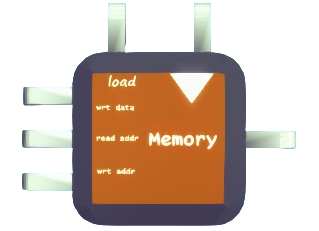

# MEMORY

Similar to REG, but can store many signal with corresponding address.

## Input Ports

There are three input ports:
- `i1`: with the type of `any`, the signal that you want to store in memory.
- `i2`: with the type of float, the memory address, from where you want to read the data (output).
- `i3`: with the type of float, the memory address that you want the signal to be written into.

## Control Ports

Same with REG

There are two control ports, `c1` and `c2`
- `c1` is the clock signal that will trigger the storage operation. `bool` type
- `c2` is the load signal that controls whether the unit should load data from `i1`. `bool` type.

## Output Ports

Same with REG

There is one output port `o1`, with type of `any`.

## Function

Once the storage operation is triggered, MEMORY will first see the value of `c1`(load). If true, REG will read the signal of `i1` and `i3`, corresponding to data and store address. Then, MEMORY will change the value in storage address to that data.

If false, MEMORY will not do storage operation.

Once `i2`, the read address is changed, MEMORY will update `o1` with the stored data with corresponding address immediately.

:::note
If a address has not been written with any data, the read operation's output will be `null`.

If `i2` or `i3` is `null`, they will be interpreted as `0(float)` and the memory will behave exactly the same as REG
:::
