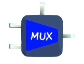

# MUX

Stands for multiplexer.

Choose one of the input signals to output.

## Input Ports

The number of inputs can be set by the first menu mapper.

There are three choices, `2 INPUT`, `3 INPUT` or `4 INPUT`.

All input ports have the type of `any`.

## Control Ports

There is one control port `c1`, with the type of `float`.

## Output Ports

There is one output ports `o1`, with the type of `any`.

## Function
