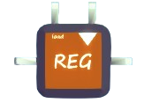

# REG

Stands for register.

Memorize the input signal as a variable and output the contained variable.

## Input Ports

There is one input port `i1`, with the type of `any`.

## Control Ports

There are two control ports, `c1` and `c2`
- `c1` is the clock signal that will trigger the storage operation. `bool` type
- `c2` is the load signal that controls whether the unit should load data from `i1`. `bool` type.

### Clock Trigger Mode

In the mapper of REG, there is a menu for the selection of trigger mode.
- `posedge`: when the signal of `c1` turns from false to true, the storage operation is triggered.
- `negedge`: when the signal of `c1` turns from true to false, the storage operation is triggered.
- `pos/neg`: sum set of `posedge` and `negedge`.

## Output Ports

There is one output port `o1`, with type of `any`.

## Function

Once the storage operation is triggered, REG will see the value of `c1`(load). If true, REG will read the signal of `i1` and set `o1` with the same value.

If false, REG will do nothing.
