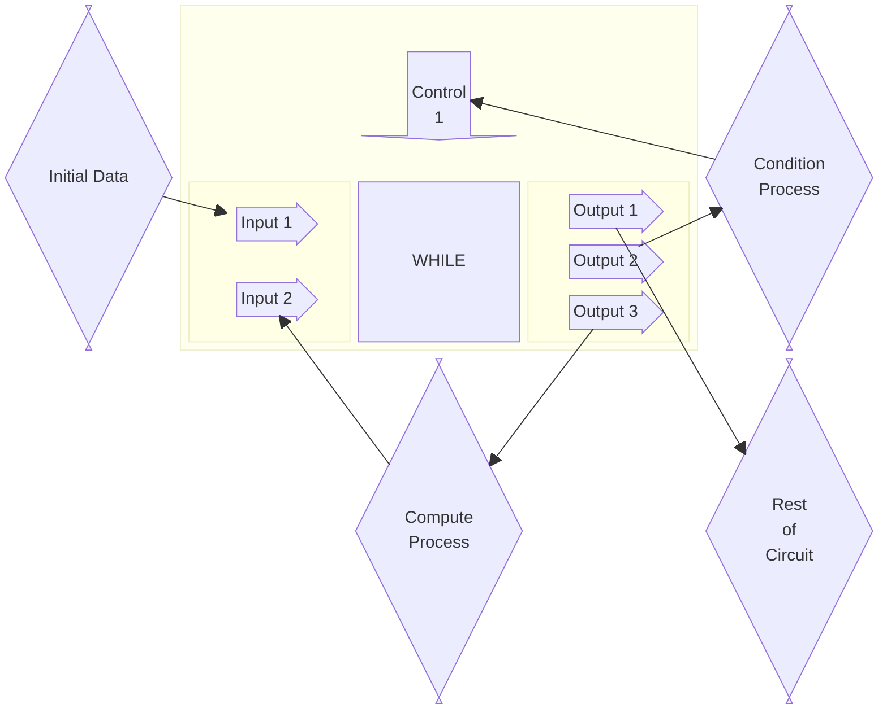

# WHILE

Conduct the conditional loop for the input.
:::warning
Rather than `while(condition){compute}` in other programming language, this unit is more similar to `do{compute} while(condition)`
:::

## Connection Sketch

The connection of WHILE should follow the following pattern.

The `Compute Process` stands for the circuit manipulating the data for each loop, such as using ALU to perform self-increasing.
:::note
The output signal type of `Compute Process` must be the same as the input signal type. Only the value can be modified.
:::

The `Condition Process` stands for the circuit responsible for judging whether the loop should go on.
:::note
The output signal type of `Condition Process` must be bool.
:::

## Input Ports

There are two input ports for while loop `i1` and `i2`.

`i1` is responsibe for receiving the initial data for the loop. `Any` type

`i2` is responsible for receiving the computed data to feed back into the loop. `Any` type

## Control Port

There is one control ports `c1`, with type `bool`, responsible for controlling whether the loop should stop

## Output Ports

There are three output ports for while loop `o1`, `o2`, `o3`.

`o1` export the result data. `Any` type.

`o2` is responsibe for receiving the initial data for the loop. `Any` type.

`o3` is responsible for receiving the computed data to feed back into the loop. `Any` type.

## Function

When the signal at `i1` changed, the same signal will be generated at `o2` and `o3` ***in order***.

When the signal at `i2` changed, the WHILE will read the bool signal at `c1`,
- if true, the signal from `i2` will be transmitted to `o2` and `o3` ***in order***.
- if false, the signal from `i2` will be transmitted to `o1` (export the result).

:::note[Why `IN ORDER` is so important]
As mentioned in `Timing` docs, once the signal at `o2` is first updated, the chain reaction will go all the way to `c1`. Then, `o3` is updated, the chain reaction will go all the way to `i2`. When `i2` is updated, WHILE can use the newest condition infomation at `c1`.
:::

:::warning
It is very likely that the `Trigger Unit` in `Initial Data` circuit trigger WHILE when other `Trigger Unit` in `Condition Process`/`Compute Process` havn't initialized yet, so the very begining result of while is very likely to be wrong. Use a Switch Sensor (`Trigger Unit`) with Mux at the end of `Initial Data` circuit and manuelly change the Switch after simulation will solve the problem.
:::
