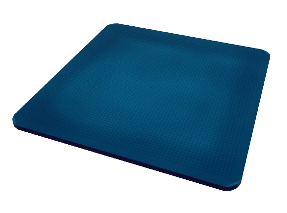
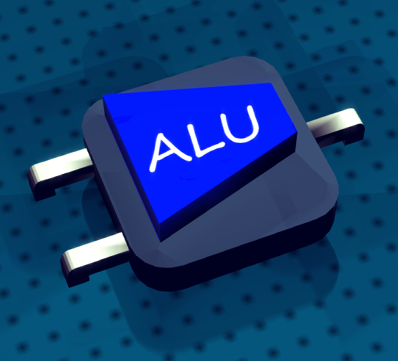
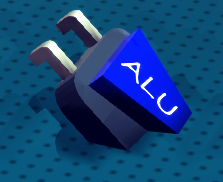
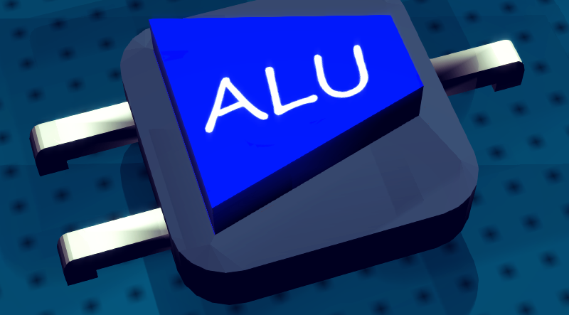
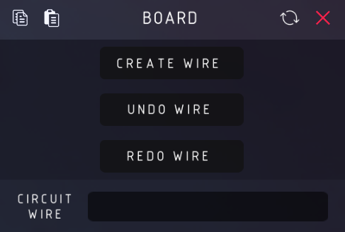
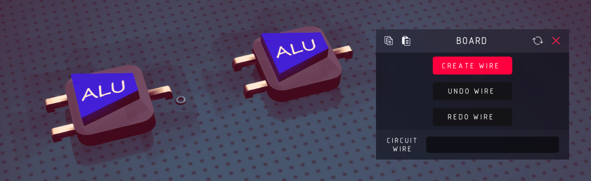
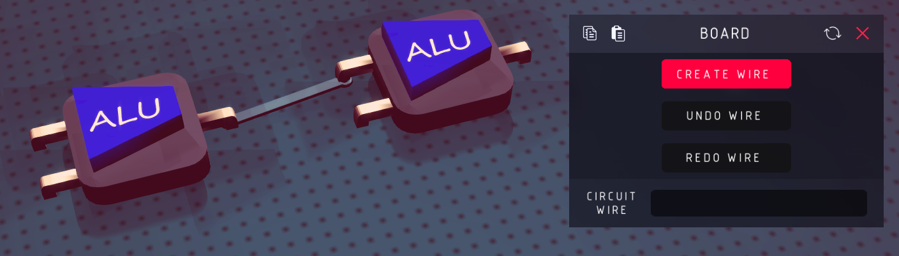
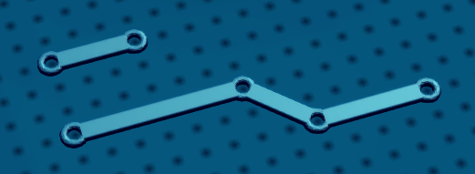

# Board

Board is the base part for a circuit. Without BOARD, you cannot wire up the on-board units.

You can place all kind of on-board unit on it and draw circuit wires to connect their ports.

## Place Units On BOARD

Just like placing normal blocks, place units on the BOARD, for example, the ALU with two inputs.

:::warning
The bottom plane of the unit should be parallel with the plane of BOARD.
i.e. the following placement is not supported

:::

At the beginning of simulation, the ports of the unit will find their port hole (**the tiny dark spot**) on the board automatically.

## Connect Ports With Circuit Wire

The BOARD has three toggle mappers (the latest one `CIRCUIT WIRE` is generated automatically, describe the connection on board, don't touch it)
- `CREATE WIRE`: turn on this toggle to start creating circuit wires on board
- `UNDO WIRE`: undo the last wire you created
- `REDO WIRE`: restore a undo operation

To connect two ports, turn on `CREATE WIRE`(you will see a little ring when your mouse pointer is on the board), left click on one port hole, hold, drag to another port hole.

### Circuit Wire

Each circuit wire has two endpoint (each of them is in a port hole).

When two port hole is connected with a circuit wire, the signal from one port hole(if there is a port insert in this hole / signal from other circuit wire) will be transmitted to the other one.

Circuit wires can be connected end to end to customize the shape of the circuit.

