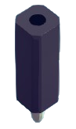
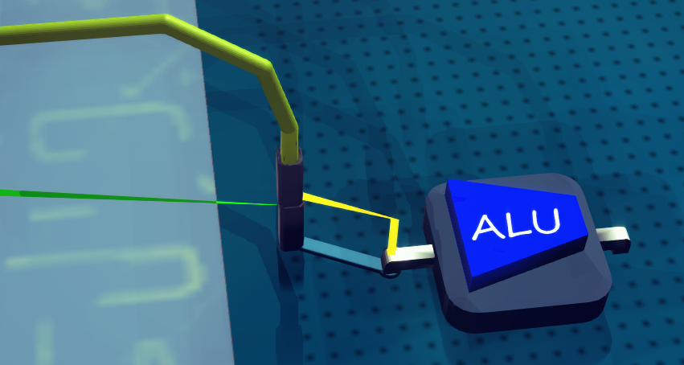

# INPUTPIN

Serve as the input pin (for receiving signal) of the board or some executors.

To receive signal, use WIRE to connect it with a OUTPUTPIN

When put on board, it acts like normal units, you can use circuit wire to transmit the signal it received to other units.

