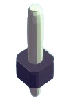
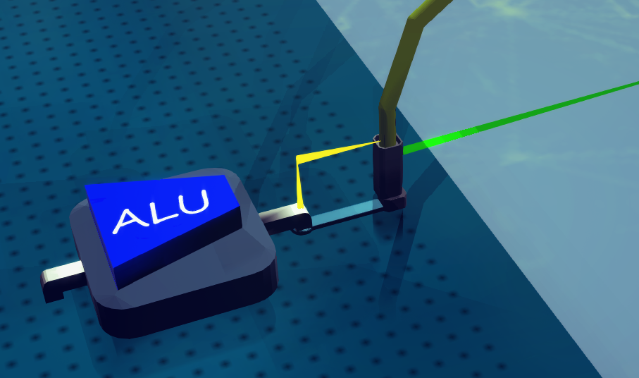

# OUTPUTPIN

Serve as the output pin (for receiving signal) of the board.

To send a signal, use WIRE to connect it with a INPUTPIN

When put on board, it acts like normal units, you can use circuit wire to transmit the signal to it.

