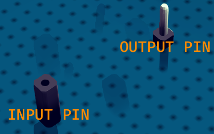
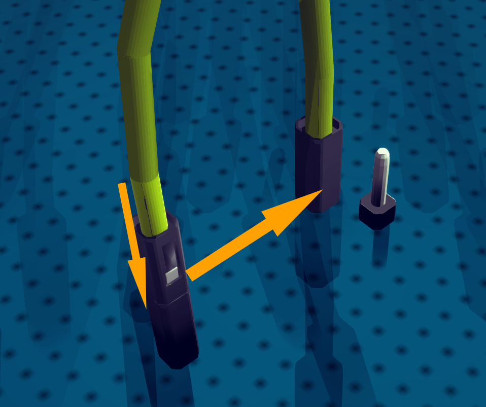
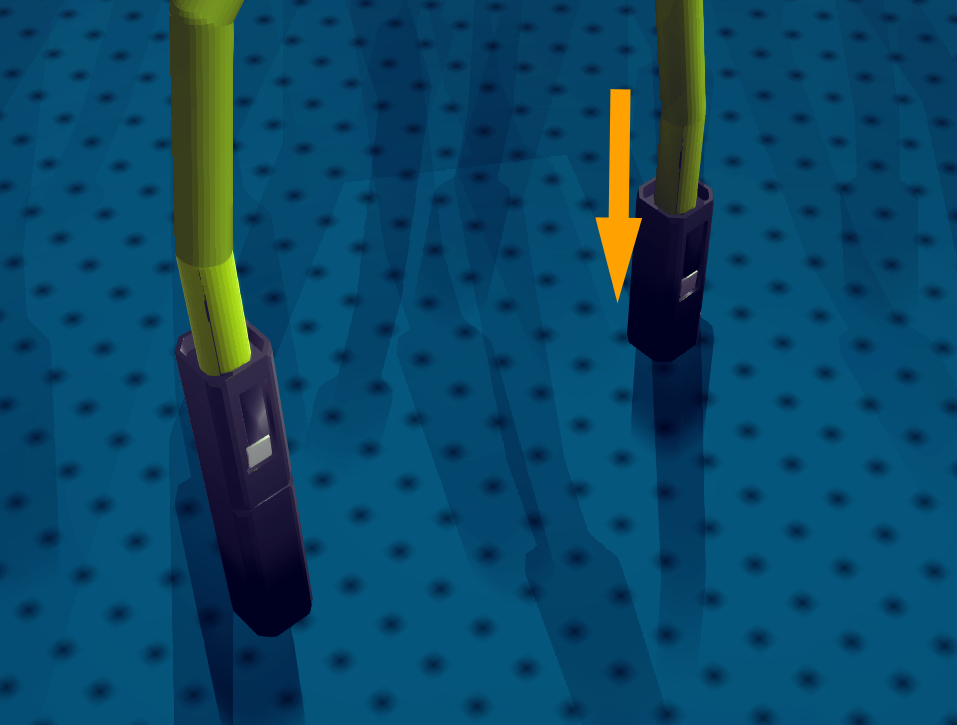

# Wire

Wire is responsible for the connection between different circuit boards or executors.

Work with INPUTPIN(input pin) and OUTPUTPIN(output pin).

## How to Create a WIRE

First you need to place both INPUTPIN and OUTPUTPIN. Then you can connect those two pins with wire.

The unit at upper-right corner is the OUTPUTPIN.

The unit at lower-left corner is the INPUTPIN.

To create the wire, select WIRE block and click on top of INPUTPIN, then drag the wire to the top of OUTPUTPIN.

## Function of WIRE

Signal will flow from OUTPUTPIN to INPUTPIN.
