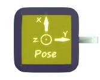
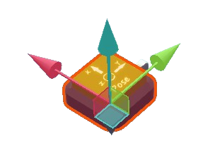

# POSE SENSOR

Generate `package` signal indicating the pose of the unit.

Wireless feature is supported when `off-board`.

## Output

The output's type is `packge`, containing three valid data.
- `Right direction vector`, with type of `vector3`, is a 3D vector pointing the right direction of the sensor. (abbreviated as `X`, red arrow)
- `Up direction vector`, with type of `vector3`, is a 3D vector pointing the up direction of the sensor. (abbreviated as `Y`, green arrow)
- `Forward direction vector`, with type of `vector3`, is a 3D vector pointing the forward direction of the sensor. (abbreviated as `Z`, blue arrow)

:::note
The order of these three data in output package is fixed, meaning that when using a UNPACKER to unpack the package, the first output is `X`, the second is `Y` and the third is `Z`.
:::
