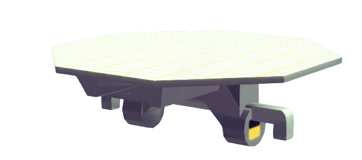

# RADAR

Detect machine blocks.

Wireless feature is supported when `off-board`.

## Property

There is a `power` slider for RADAR, for adjusting the power(range, the volume covered by the RADAR) of the RADAR.

## Input

The input signal should be `float` type. This input is used for adjusting the shape of the radar beam (bigger range with smaller width / smaller range with big width).

## Output

The output's type is `packge`, containing three valid data.
- `Has Target`, with type of `bool`, indicating whether there is a target detected.
- `Target position`, with type of `vector3`, is a 3D vector showing the detected targets' world position.
- `Target velocity`, with type of `vector3`, is a 3D vector showing the detected targets' velocity.

:::note
The order of these three data in output package is fixed
:::
